<div align="center">

<table>
<tr>

<td width="45%" align="center">

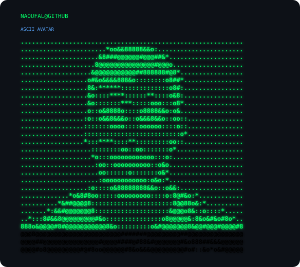

</td>

<td width="55%" align="center">

<picture>
  <source
    media="(prefers-color-scheme: dark)"
    srcset="./assets/naoufal-dark.svg">

  <source
    media="(prefers-color-scheme: light)"
    srcset="./assets/naoufal-light.svg">

  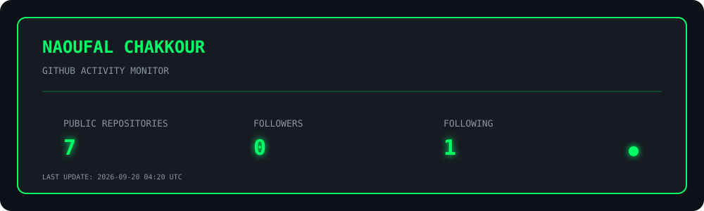
</picture>

</td>

</tr>
</table>

</div>


<div align="center">


</div>

<br>

<div align="center">


<br>


<br>


<br>


<br>


</div>

<br>

<div align="center">
<table>
<tr>
<td align="center" width="20%">
<h3>6+</h3>
<sub><b>SECURITY DOMAINS</b></sub><br>
<sub>networking, web, Linux and IoT</sub>
</td>
<td align="center" width="20%">
<h3>10+</h3>
<sub><b>TOOLS EXPLORED</b></sub><br>
<sub>from Nmap to Wireshark</sub>
</td>
<td align="center" width="20%">
<h3>3</h3>
<sub><b>CORE LANGUAGES</b></sub><br>
<sub>C# · Python · Bash</sub>
</td>
<td align="center" width="20%">
<h3>1</h3>
<sub><b>MAIN OBJECTIVE</b></sub><br>
<sub>learn by building and testing</sub>
</td>
<td align="center" width="20%">
<h3>0</h3>
<sub><b>SHORTCUTS</b></sub><br>
<sub>understand before assuming</sub>
</td>
</tr>
</table>
</div>

---

<h2>The principle everything else follows from</h2>

<blockquote>
<b>Understand the system before trying to break it. Test only what you are authorised to test, preserve the evidence, and learn from the result.</b>
</blockquote>

My focus is cybersecurity, networking and software development through practical experimentation.

I learn by investigating how systems actually behave: how networks communicate, how services expose interfaces, how authentication works, how IoT devices publish their capabilities, and how security tools turn observations into useful evidence.

The goal is not to collect tool names.

The goal is to understand <b>why a tool produces a result, what that result proves, what it does not prove, and how to verify it.</b>

That approach is especially important when working with networked and IoT devices. An open port is not automatically a vulnerability. A <code>401 Unauthorized</code> response is not automatically a failure. A discovery endpoint is not necessarily an administrative endpoint.

The interesting part is understanding the boundary between them.

<h3>The ecosystem, area by area</h3>

| Area | Domain | What I work with |
|:--:|---|---|
| **A** | Networking & reconnaissance | TCP/IP, DNS, HTTP/S, SSH, ports, services, Nmap |
| **B** | Linux & security tooling | Kali Linux, Bash, permissions, processes, services |
| **C** | Web & authentication | HTTP, headers, authentication flows, Digest authentication |
| **D** | IoT & cameras | ONVIF, RTSP, network cameras, device discovery |
| **E** | Traffic analysis | Wireshark, packet capture, protocols and network behaviour |
| **F** | Vulnerability assessment | GVM/OpenVAS, CVEs, scan results and verification |
| **G** | Programming | C#, .NET, Python, scripting and automation |
| **H** | Security laboratories | isolated environments, reproducible tests and documentation |

<div align="center">


</div>

<sub>The ecosystem represents the areas I am actively developing, with an emphasis on practical understanding rather than claiming expertise I have not yet earned.</sub>

<h2>Node A in depth — networking &amp; reconnaissance</h2>

<div align="center">


</div>

**TCP/IP**, **DNS**, **HTTP/S**, **SSH**, ports, services and network discovery form the foundation of my cybersecurity work.

<table>
<tr>
<td width="34%" valign="top">

#### A port is only the beginning

An open port tells me that something is listening. It does not tell me whether that service is vulnerable.

The next step is identifying the protocol, service, version, authentication boundary and actual behaviour.

</td>
<td width="33%" valign="top">

#### Discovery before assumptions

Nmap helps turn an unknown network into observable information.

Ports, service detection and version information become starting points for investigation rather than conclusions.

</td>
<td width="33%" valign="top">

#### Evidence matters

Every important observation should be reproducible.

Commands, responses, packet captures and timestamps are more useful than a screenshot saying "it works."

</td>
</tr>
</table>

<details>
<summary><b>&nbsp;What reconnaissance is actually for</b></summary>

<br>

Reconnaissance answers a few practical questions:

<table>
<tr><td width="30%"><b>what exists</b></td><td>hosts, ports, services and interfaces that are actually reachable</td></tr>
<tr><td><b>what is exposed</b></td><td>protocols and management interfaces visible from the tested position</td></tr>
<tr><td><b>what is protected</b></td><td>authentication boundaries and differences between public and restricted endpoints</td></tr>
</table>

A scan is not the security assessment itself.

It is the map that makes a meaningful assessment possible.

</details>


---

<h2>Node B in depth — Linux &amp; security tooling</h2>

<div align="center">

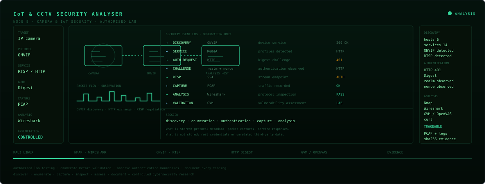

</div>

**Linux**, **Kali Linux**, **Bash** and the command line are part of the environment I use to understand cybersecurity tools and reproduce technical behaviour.

<table>
<tr>
<td width="34%" valign="top">

#### Know what the command does

Running a command copied from a tutorial is not the same as understanding it.

I focus on the flags, network requests, files, permissions and output behind the command.

</td>
<td width="33%" valign="top">

#### Build isolated laboratories

Security experiments belong in environments where the target is mine or explicitly authorised.

Virtual machines, local services and dedicated devices make experimentation reproducible.

</td>
<td width="33%" valign="top">

#### Diagnose instead of guessing

When a security tool fails, the failure itself is information.

Logs, permissions, processes, ports and configuration should be investigated before changing random settings.

</td>
</tr>
</table>

<details>
<summary><b>&nbsp;The laboratory approach</b></summary>

<br>

A useful security lab should allow an experiment to be repeated.

That means controlling:

- the target
- the network
- the credentials
- the service configuration
- the tool version
- the captured evidence
- the expected result

If the same experiment cannot be reproduced, the conclusion should remain provisional.

</details>


---

<h2>Node C in depth — web security &amp; authentication</h2>

<div align="center">


</div>

**HTTP**, **HTTPS**, headers, authentication flows and **HTTP Digest Authentication** are areas where I am developing practical understanding.

<table>
<tr>
<td width="34%" valign="top">

#### Authentication is a protocol

A login page is only the visible part.

The important questions are what the client sends, what the server challenges, how credentials are protected and what changes after authentication.

</td>
<td width="33%" valign="top">

#### 401 is useful evidence

An HTTP <code>401 Unauthorized</code> response can tell us that an endpoint exists but requires authentication.

That is very different from an endpoint being unreachable.

</td>
<td width="33%" valign="top">

#### Follow the protocol

Headers such as <code>WWW-Authenticate</code>, nonces, realms and authentication algorithms can reveal how the authentication exchange actually works.

</td>
</tr>
</table>

<details>
<summary><b>&nbsp;Why authentication analysis matters</b></summary>

<br>

A useful assessment begins by understanding the authentication mechanism:

<table>
<tr><td width="30%"><b>challenge</b></td><td>what does the server request?</td></tr>
<tr><td><b>response</b></td><td>what does the client calculate and send?</td></tr>
<tr><td><b>session</b></td><td>what proves that authentication succeeded?</td></tr>
<tr><td><b>boundary</b></td><td>which resources remain protected?</td></tr>
</table>

Understanding these boundaries is more valuable than simply obtaining access.

</details>


---

<h2>Node D in depth — IoT &amp; network cameras</h2>

<div align="center">

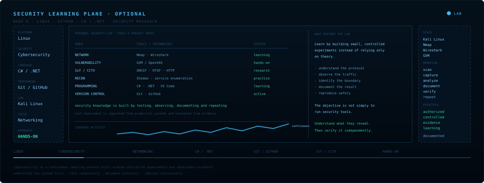

</div>

**IoT security**, especially network-connected cameras and **ONVIF/RTSP**, is one of the areas where I have been doing practical protocol research.

<table>
<tr>
<td width="34%" valign="top">

#### Discovery is not control

An IoT device may expose information for discovery while protecting operational functions behind authentication.

Those two surfaces must be analysed separately.

</td>
<td width="33%" valign="top">

#### Protocol behaviour tells the story

ONVIF services, SOAP requests, HTTP status codes, authentication challenges and RTSP behaviour provide evidence about the device architecture.

</td>
<td width="33%" valign="top">

#### Test the boundary

The interesting question is not simply "is the camera exposed?"

It is:

<b>which interface is exposed, from where, and with what privileges?</b>

</td>
</tr>
</table>

<details>
<summary><b>&nbsp;What IoT research looks like</b></summary>

<br>

A camera can expose several logically different surfaces:

<table>
<tr><td width="30%"><b>discovery</b></td><td>finding the device and learning basic service information</td></tr>
<tr><td><b>management</b></td><td>configuration and administrative interfaces</td></tr>
<tr><td><b>media</b></td><td>video-related services such as RTSP</td></tr>
<tr><td><b>control</b></td><td>operations such as PTZ where supported</td></tr>
</table>

The assessment becomes useful when these surfaces are mapped against their authentication and authorisation requirements.

All testing is performed against systems I own or am explicitly authorised to assess.

</details>


---

<h2>Node E in depth — traffic analysis</h2>

<div align="center">

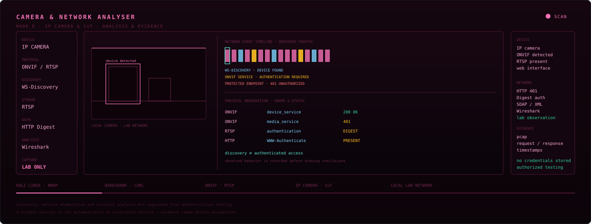

</div>

**Wireshark** provides a different perspective from a port scanner: instead of asking what is available, I can inspect what actually travels across the network.

<table>
<tr>
<td width="34%" valign="top">

#### Packets are evidence

A packet capture can confirm whether a request was actually sent, which endpoint answered and what protocol sequence occurred.

</td>
<td width="33%" valign="top">

#### Timing matters

Connection establishment, retries, retransmissions and response latency can explain behaviour that looks mysterious from an application interface.

</td>
<td width="33%" valign="top">

#### Decode before interpreting

Protocol fields should be understood before drawing conclusions.

A packet capture is raw evidence; the interpretation comes afterwards.

</td>
</tr>
</table>

<details>
<summary><b>&nbsp;Why packet analysis matters</b></summary>

<br>

When an application says "the connection failed", several different things may actually have happened:

- DNS failed
- TCP connection failed
- TLS negotiation failed
- the server returned an error
- authentication failed
- the application rejected an otherwise valid response

Packet analysis helps separate those cases.

</details>


---

<h2>Node F in depth — vulnerability assessment</h2>

<div align="center">


</div>

**GVM/OpenVAS**, vulnerability feeds, **CVEs**, service enumeration and manual verification are part of my security learning path.

<table>
<tr>
<td width="34%" valign="top">

#### A scanner produces hypotheses

A vulnerability scanner can identify a possible issue.

It does not automatically prove that the issue is exploitable in the exact environment.

</td>
<td width="33%" valign="top">

#### Verify the finding

The useful workflow is:

<b>finding → evidence → affected service → configuration → verification</b>

A scanner result without context can easily be misunderstood.

</td>
<td width="33%" valign="top">

#### False positives are lessons

Understanding why a scanner reported something — and why it may not apply — is part of learning vulnerability assessment.

</td>
</tr>
</table>

<details>
<summary><b>&nbsp;How I read a vulnerability finding</b></summary>

<br>

For each finding I want to establish:

<table>
<tr><td width="30%"><b>what was detected</b></td><td>service, version, protocol or configuration</td></tr>
<tr><td><b>why it matters</b></td><td>the potential security impact</td></tr>
<tr><td><b>what evidence exists</b></td><td>scan output, banners, packets or configuration</td></tr>
<tr><td><b>does it apply</b></td><td>manual verification against the actual test environment</td></tr>
</table>

The goal is not to produce the largest vulnerability list.

The goal is to produce findings that can be explained and reproduced.

</details>


---

<h2>Node G in depth — programming &amp; automation</h2>

<div align="center">


</div>

**C#**, **.NET**, **Python** and **Bash** form the programming side of my development path.

<table>
<tr>
<td width="34%" valign="top">

#### C# &amp; .NET

I am developing my software foundations with C# and .NET, focusing on programming fundamentals, object-oriented programming and practical applications.

</td>
<td width="33%" valign="top">

#### Python

Python is particularly useful for security automation, parsing, network experiments and turning repetitive analysis into scripts.

</td>
<td width="33%" valign="top">

#### Automation with understanding

The objective is not simply to automate commands.

A useful security script should produce structured, understandable and reproducible results.

</td>
</tr>
</table>

<details>
<summary><b>&nbsp;Where programming meets security</b></summary>

<br>

The intersection is where the work becomes particularly interesting:

<table>
<tr><td width="30%"><b>network tools</b></td><td>automating discovery and analysis in authorised laboratories</td></tr>
<tr><td><b>parsing</b></td><td>turning raw output and logs into structured information</td></tr>
<tr><td><b>analysis</b></td><td>comparing observations and identifying anomalies</td></tr>
<tr><td><b>reproducibility</b></td><td>turning a manual experiment into a repeatable procedure</td></tr>
</table>

The long-term objective is to become strong enough in software engineering that security tooling becomes something I can understand, modify and eventually build — rather than merely operate.

</details>


---

<h2>Node H in depth — research &amp; security laboratories</h2>

<div align="center">

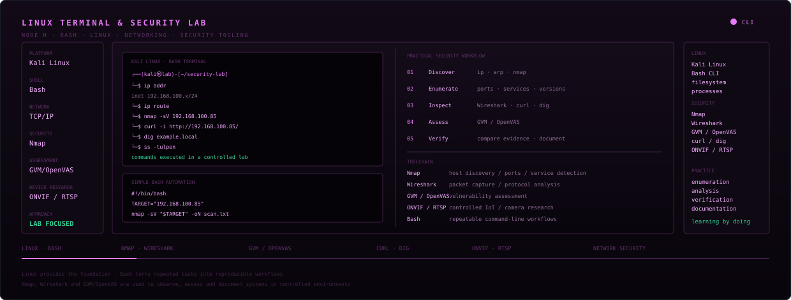

</div>

A strong security workflow needs more than tools. It needs **scope, isolation, evidence and documentation**.

<table>
<tr>
<td width="34%" valign="top">

#### Own the target

Experiments are performed against systems I own, intentionally vulnerable environments, or systems for which explicit permission exists.

</td>
<td width="33%" valign="top">

#### Preserve the evidence

Commands, responses, logs and captures make it possible to return to an experiment and understand what actually happened.

</td>
<td width="33%" valign="top">

#### Learn from failure

A failed experiment is useful when the reason for failure is understood.

Configuration errors, authentication boundaries and unexpected protocol behaviour are all part of the learning process.

</td>
</tr>
</table>

<details>
<summary><b>&nbsp;The research loop</b></summary>

<br>

```text
  hypothesis
      │
      ▼
  controlled lab
      │
      ▼
  observation
      │
      ▼
  evidence
      │
      ▼
  interpretation
      │
      ▼
  reproduction
      │
      └──────────> refined hypothesis
