# NAOUFAL CHAKKOUR

### CYBERSECURITY • NETWORKING • SOFTWARE DEVELOPMENT

`KALI LINUX` · `NETWORK SECURITY` · `C# / .NET` · `LINUX` · `IoT`

---

## ◈ SYSTEM PROFILE

## ◈ TECHNOLOGY NODES

## ◈ NODE MATRIX

## ◈ CURRENTLY LEARNING

## ◈ TOOLKIT

## ◈ PROJECTS

## ◈ SECURITY LAB

## ◈ DEVELOPMENT

## ◈ CONNECT

