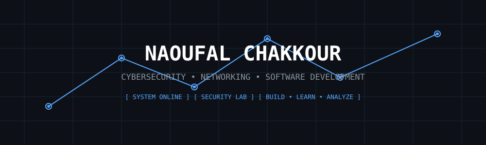
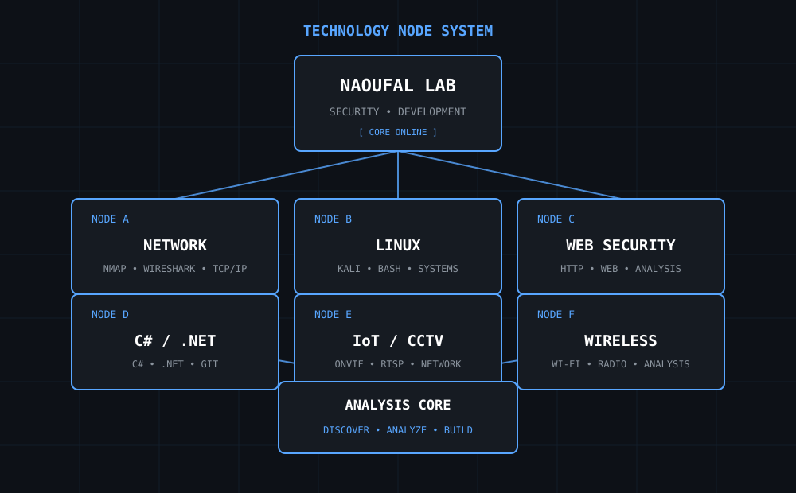

# NAOUFAL CHAKKOUR

### CYBERSECURITY • NETWORKING • SOFTWARE DEVELOPMENT

`KALI LINUX` · `NETWORK SECURITY` · `C# / .NET` · `LINUX` · `IoT`

---

## ◈ SYSTEM PROFILE

## ◈ TECHNOLOGY NODES

## ◈ NODE MATRIX

## ◈ CURRENTLY LEARNING

## ◈ TOOLKIT

## ◈ PROJECTS

<table>
<tr>

<td width="50%" align="center">

### Csharp-learning

C# learning repository containing practical programming exercises and experiments.

<a href="https://github.com/Naoufal-Chakkour/Csharp-learning">
View Repository →
</a>

</td>

<td width="50%" align="center">

### MyCalculatorApp

C# calculator application developed during the .NET learning process.

<a href="https://github.com/Naoufal-Chakkour/MyCalculatorApp">
View Repository →
</a>

</td>

</tr>

<tr>

<td width="50%" align="center">

### MyWebsite

Frontend web development project focused on HTML and CSS experimentation.

<a href="https://github.com/Naoufal-Chakkour/MyWebsite">
View Repository →
</a>

</td>

<td width="50%" align="center">

### guess_Game

A simple web-based guessing game built as a frontend development exercise.

<a href="https://github.com/Naoufal-Chakkour/guess_Game">
View Repository →
</a>

</td>

</tr>
</table>

## ◈ GITHUB ANALYTICS

## ◈ SECURITY LAB

## ◈ DEVELOPMENT

## ◈ CONNECT

